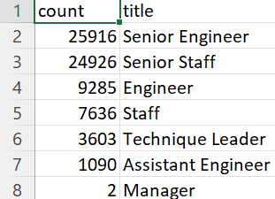

# Pewlett-Hackard-Analysis
## Overview
The purpose of this analysis was to build a database to determine who would be retiring from Pewlett Hackard, the amount of specific roles that would need to be filled, and who would be elgible fo their mentorship program.

---

## Results
### Number of Retiring Employees 
1. There are about 26,000 senior engineers that are getting ready to retire.
2. Overall, there are over 72,000 people that are getting ready to retire.


### Mentorship Eligibility
3. Over 1500 people are elgible for mentorship.
4. There are very few people eligible to be in the mentorship program compared to the roles that need to be filled.

---

## Summary
- 72,458 roles will need to be filled as the "silver tsunami" begins to make an impact.
- Unfortunately, there are not enough qualified retirement-ready employees in the departments to mentor the next generation of Pewlett Hackard employees. Based on the code we used to generate the employee names, only 1549 employess were eligible:
```
SELECT DISTINCT ON (emp_no) em.emp_no, em.first_name, em.last_name, em.birth_date, ti.title
INTO mentorship_eligibility
FROM employees as em
INNER JOIN dept_emp as de
ON (em.emp_no = de.emp_no)
INNER JOIN titles as ti
ON (em.emp_no = ti.emp_no)
WHERE (de.to_date = '9999-01-01')
AND (em.birth_date BETWEEN '1965-01-01' AND '1965-12-31')
ORDER BY em.emp_no;
```

